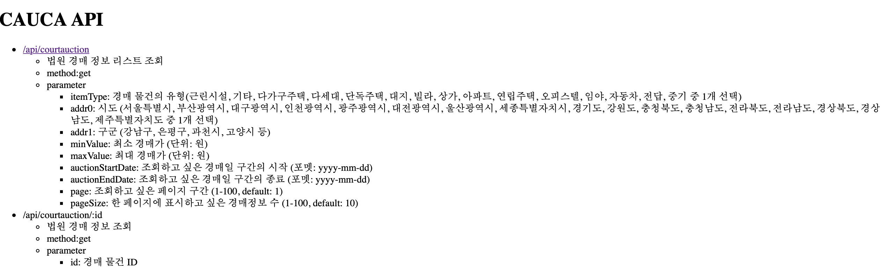
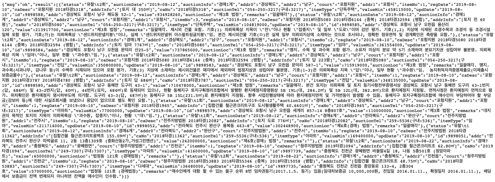
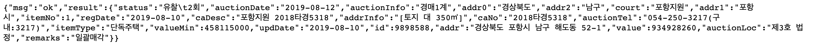

# CAUCA

## 소개
* CAUCA는 Court AUCtion Api service로 [clojure](http://clojure.org)를 이용해서 법원 경매 사이트를 수집하고, 사용자에게 REST API를 제공하는 서비스입니다.

## 요구사항
* JDK 6+
* MySQL 5.x
* [leiningen](http://leiningen.org)

```
$> wget --no-check-certificate https://raw.github.com/technomancy/leiningen/stable/bin/lein
$> mv lein ~/bin/
$> chmod 755 ~/bin/lein
$> lein self-install
```

## 환경설정
* MySQL
 * USER 생성

```
mysql> CREATE USER '$CAUCA_USER$'@'%' IDENTIFIED BY '$CAUCA_PASSWORD$';
mysql> GRANT ALL PRIVILEGES ON cauca.* TO '$CAUCA_USER$'@'%' WITH GRANT option;
mysql> FLUSH PRIVILEGES;
```
 * DATABASE 생성

```
mysql> CREATE DATABASE cauca;
mysql> FLUSH PRIVILEGES;
```
* src/resources/cauca-context.yaml 에서 DB 정보 수정

```
:
db.subname: "//$CAUCA_HOST$:3306/cauca"
db.user: "$CAUCA_USER$"
db.password: "$CAUCA_PASSWORD$"
:
```

## 실행방법

```
# build
$> lein do clean, uberjar

# crawler
## crawler start
## Usage: lein daemon start crawler [REPEAT COUNT] [SLEEP SECOND]
##   REPEAT COUNT: -1(infinite), 1, 2, ...
##   SLEEP SECOND: Repeat the cycle
$> lein daemon start crawler -1 86400
## crawler stop
$> lein daemon stop crawler

# rest
## rest start
$> lein daemon start rest
## test main-page: http://127.0.0.1:8080
## rest stop
$> lein daemon stop rest

# lein daemon 은 Unix 계열에서만 실행이 되므로 Windows 에서는 uberjar 로 만든 jar 파일을 직접 실행하면 됩니다. 
$> java -cp .;src\resources;target\cauca-0.1.0-SNAPSHOT-standalone.jar cauca.component.crawler [REPEAT COUNT] [SLEEP SECOND]
$> java -cp .;src\resources;target\cauca-0.1.0-SNAPSHOT-standalone.jar cauca.component.rest
```

## Demo
* Screenshot
  * home 
  * /api/countauction 
  * /api/countauction/:id 